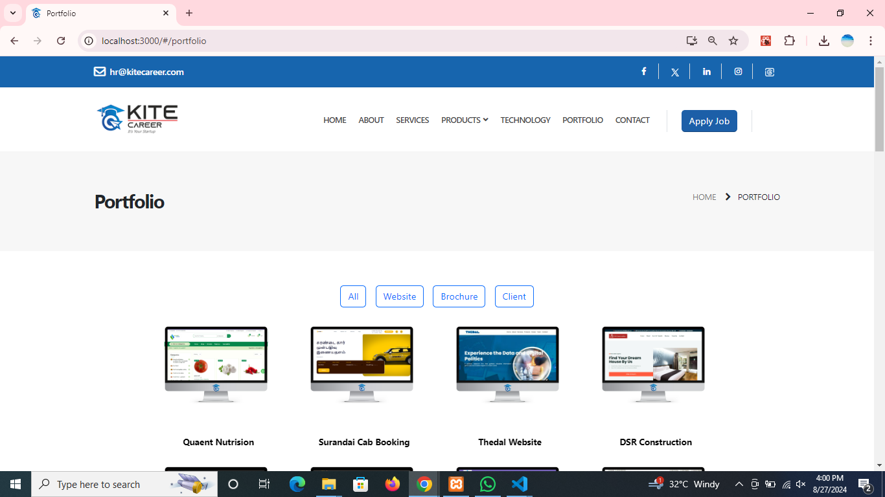

Follow the Steps:
    1.Download the Zip(file)/https://github.com/MJTHENU/Kite.git
    2.Extrect  the File
    3.npm install /npm install -f
    4.npm Start

Output: http://localhost:3000/

Screenshots:

<video controls src="./screenshots/kiteWebsite.mp4" title="Title"></video>

